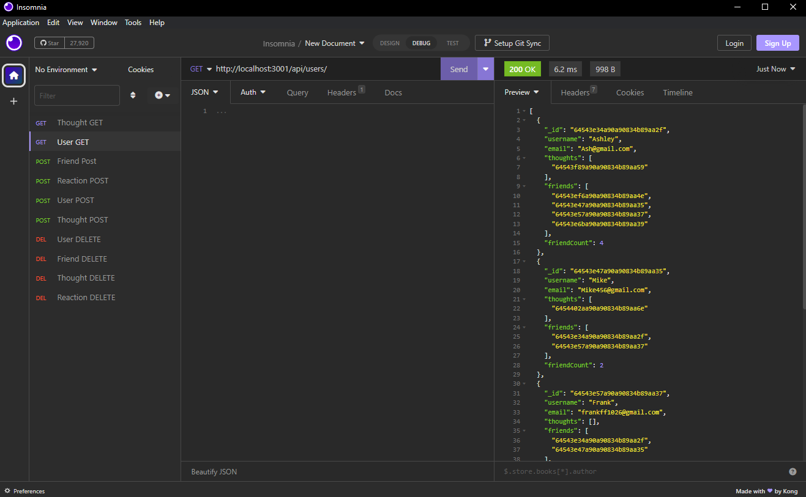
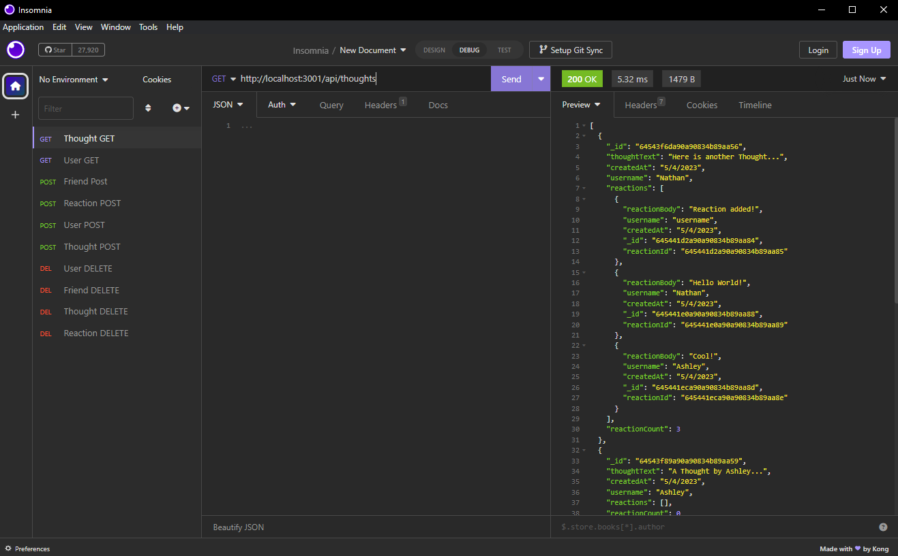

# Social-Network-API-Model
A social network API created during the UCI Coding.
Allows for the creation of a User, who can posts messages known as "Thoughts", and other users can add replys in the form as "Reactions."
This API contains no front-end and can be interacted with Insomnia.

Technologies in use are:
- Mongoose - for the database.
- Express.js - as backend web application framework.

## Table of Contents

- [Video Demonstration](#video-demonstration)
- [Screenshots](#screenshots)
- [How To Run](#how-to-run)
- [User Story](#user-story)
- [Acceptance Criteria](#acceptance-criteria)
- [About](#about)

## Video Demonstration

[Social Network Backend API Model](https://drive.google.com/file/d/1p8wq2StcBfobocv8wBX5VNUiC1k-T4AF/view)

## Screenshots




## How to Run

In order to get this application running, you'll need to install Insomnia in order to retrive all the data and create data from the data base.
You'll then have to run the command "npm install" in order to get the mongoose and express library started.
After that, run the command "npm start" and then the server will be started in the following local enviornment.

- Once the above criteria has been met, do these in order to populate the empty database
    - Create a few users user via post route
    - Add a couple of thoughts
    - Add reactions to created thoughts
    - with new users created, you can now add users as friends.
    - From here you can update and/or delete users, thoughts, friends, and reactions as desired.

```
http://localhost:3001/
```
Here are the following links to use
- User related links
    - Get Users
    - Post Users
        - http://localhost:3001/api/users/
    - Delete User
    - Update User
        - http://localhost:3001/api/users/{ADD USER ID HERE WITHOUT BRACKETS}
    - Add Friends
    - Delete Friends
        - http://localhost:3001/api/users/{USER ID HERE}/friends/{FRIEND ID HERE}
- Thought related links
    - Get Thoughts
    - Post Thoughts
        - http://localhost:3001/api/thoughts
    - Delete Thought
    - Update Thought
        - http://localhost:3001/api/users/{ADD THOUGHT ID HERE WITHOUT BRACKETS}
- Reaction Realted links
    - Post Reaction
        - http://localhost:3001/api/thoughts/{THOUGHT ID TO ATTACH REACTION TO}/reactions
    - Delete Reaction 
        - http://localhost:3001/api/thoughts/{REACTION ID}/reactions
### Post Bodies

- New User
- Update User
```
{
    "username": "FooBar",
    "email": "foo@bar.com"
} 
```
- New Thought
- Update Thought
```
{
    "thoughtText": "Here's a cool thought...",
    "username": "lernantino",
    "userId": "5edff358a0fcb779aa7b118b"
}
```
- Add Reaction
```
{
    "reactionBody": "text goes here", 
    "username": "username"
}
```
## User Story

```md
AS A social media startup
I WANT an API for my social network that uses a NoSQL database
SO THAT my website can handle large amounts of unstructured data
```

## Acceptance Criteria

```md
GIVEN a social network API
WHEN I enter the command to invoke the application
THEN my server is started and the Mongoose models are synced to the MongoDB database
WHEN I open API GET routes in Insomnia for users and thoughts
THEN the data for each of these routes is displayed in a formatted JSON
WHEN I test API POST, PUT, and DELETE routes in Insomnia
THEN I am able to successfully create, update, and delete users and thoughts in my database
WHEN I test API POST and DELETE routes in Insomnia
THEN I am able to successfully create and delete reactions to thoughts and add and remove friends to a user’s friend list
```

## About

By Nathan Shaw
- Github: [nshaw973](https://github.com/nshaw973)